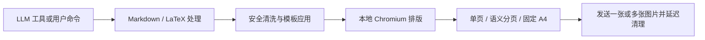

<div align="center">
  
  <h1>LaTeX Render</h1>
  <p><strong>Markdown / LaTeX 本地图片渲染，支持自动分页与 A4 版式</strong></p>
  <p>面向 AstrBot 的本地 Markdown / LaTeX 图片渲染插件。内容在本机 Chromium 中完成排版，LLM 可以主动调用工具出图，管理员也可以在渲染工作台中实时预览、调参和管理自定义模板。</p>
  <p>
    <a href="https://github.com/AstrBotDevs/AstrBot"></a>
    
    <a href="https://www.python.org/"></a>
    <a href="LICENSE"></a>
  </p>
  <p>
    <a href="#产品定位">产品定位</a> ·
    <a href="#核心能力">核心能力</a> ·
    <a href="#webui-渲染工作台">WebUI 工作台</a> ·
    <a href="#安装与启用">安装使用</a> ·
    <a href="#首次使用">首次使用</a> ·
    <a href="#配置">配置</a> ·
    <a href="#模板与命令">模板与命令</a> ·
    <a href="#问题排查">问题排查</a> ·
    <a href="CHANGELOG.md">版本变化</a>
  </p>
</div>

## 产品定位

LaTeX Render 给 AstrBot 增加一个 `render_to_image` 工具：LLM 先写完整内容，插件再把 Markdown、LaTeX 和模板样式交给本地 Chromium，最后只把生成的图片发送到当前会话。

插件不接管正常回复，也不依赖在线排版服务。MathJax 随插件离线提供，内置模板只使用宿主机字体；是否出图、写什么内容、选哪个模板，仍由当前 Agent 和用户指令决定。

当前发布版本为 `1.1.0`，要求 AstrBot `>=4.26.3`。

## 核心能力

| 功能          | 实现                                                                       | 边界                                 |
| ----------- | ------------------------------------------------------------------------ | ---------------------------------- |
| LLM 工具调用    | Agent 可调用 `render_to_image`，将完整内容渲染并发送为图片                                | 不拦截普通消息，不自动把所有回复转为图片               |
| Markdown 排版 | 通过 Mistune 处理标题、列表、引用、代码块、删除线和表格                                         | 可在 WebUI 中关闭                       |
| LaTeX 公式    | 识别 `$...$`、`$$...$$`、`\(...\)`、`\[...\]` 和 `\begin{...}` / `\end{...}` 块 | 具体语法支持范围由插件附带的 MathJax 决定          |
| 智能分页        | 超过页高预算后按 Markdown 顶层语义块拆成多图                                              | 公式、表格和代码块优先整体换页；极端超高单块会带续页标记       |
| 内置模板        | 仓库提供 `classic`、`novel` 和固定 A4 `paper`                                    | `templates/` 中至少需要一个可用模板           |
| 渲染工作台       | 独立插件页面提供基础设置、模板画廊、实时滑条预览和自定义模板编辑                                         | 完整底层选项仍保留在 AstrBot 配置页             |
| 自定义模板       | 提供唯一的 `custom` 模板槽，可实时编辑 HTML/CSS、预览、保存并进行 JSON 备份                       | 脚本、事件属性、嵌入页面及远程 URL 会被拒绝           |
| 模板选择        | `/切换` 设置当前用户的默认模板；LLM 工具可单次指定                                          | 模板与布局偏好写入插件数据目录，重载后保留              |
| 本地渲染        | Playwright / Chromium 在 AstrBot 主机上排版并截图                                 | 首次启动会下载 Chromium；Linux 环境可能还需安装系统库 |
| 安全边界        | 默认清洗危险 HTML，Chromium 保持离线并受资源预算约束                                        | 原始 HTML/远程资源只能由管理员显式开启可信模式         |

## WebUI 渲染工作台

安装并重载插件后，可在 AstrBot WebUI 左侧的“插件页面”中打开“LaTeX / Markdown 图片渲染”，也可以访问：

```text
http://<AstrBot 地址>/#/plugin-page/astrbot_plugin_latex_render/studio
```

工作台的 preview API 与正式渲染共用模板解析、分页和 Chromium 截图组件。

| 区域        | 功能                                                                | 边界                                        |
| --------- | ----------------------------------------------------------------- | ----------------------------------------- |
| 基础设置      | 调整常用配置与自动分页高度，查看 Chromium、MathJax、CJK 字体、渲染队列和错误状态                | 完整配置仍在 AstrBot 配置页                        |
| 模板画廊      | 选择模板与分页布局，编辑 Markdown 样例，通过 preview API 查看实际分页结果                  | 内置模板只读；滑条只显示模板 manifest 公开的 CSS variables |
| Custom 编辑 | 编辑固定 `custom` 槽的 HTML/CSS 和 Markdown 样例，通过草稿渲染预览后保存；支持 JSON 导入和导出 | 只维护一个 `custom`；模板校验会拒绝主动内容和远程 URL         |

预览画布支持缩放、适应页面、多页切换和可选抓手。抓手默认关闭，普通滚轮继续滚动页面，`Ctrl/Command + 滚轮`用于缩放。Gallery 与 Custom 的 Markdown 内容卡片会完整展示默认测试文本；超长输入达到保护高度后使用卡片内部滚动，避免无限拉长页面。

内置模板保存在源码目录并保持只读。`custom` 保存在 `data/plugin_data/astrbot_plugin_latex_render/custom_templates/`，已保存的个性化编辑不会被插件升级覆盖。

## 渲染流程



渲染缓存和 Playwright 浏览器默认写入：

```text
data/plugin_data/astrbot_plugin_latex_render/
├── latex_cache/
├── playwright_browsers/
├── custom_templates/
└── preferences.json
```

插件不会把运行数据写回源码目录，因此更新或重装插件时不会把缓存和浏览器文件混进插件包。

## 安装与启用

### 安装

推荐在 AstrBot WebUI 的插件市场中搜索“LaTeX / Markdown 图片渲染”并安装。若暂未检索到，可从 [GitHub Releases](https://github.com/6TBWhite/astrbot_plugin_latex_render/releases) 下载 ZIP，再进入“AstrBot 插件 → 安装插件 → 从文件安装”上传。

也可以在支持仓库地址安装的界面中使用：

```text
https://github.com/6TBWhite/astrbot_plugin_latex_render
```

安装或更新后，请重载插件或重启 AstrBot。

### 依赖分工

Python 依赖、浏览器二进制和操作系统组件采用不同的安装方式。请根据下表确认当前环境还需要完成哪些步骤。

| 依赖                              | 默认处理方式                             | 是否可能需要手动安装                      |
| ------------------------------- | ---------------------------------- | ------------------------------- |
| `playwright`、`mistune`、`Pillow` | AstrBot 根据 `requirements.txt` 自动安装 | 仅在 AstrBot 自动安装失败时              |
| Chromium headless shell         | 插件首次启动时自动下载到插件数据目录                 | 网络受限、无写入权限或自动下载失败时              |
| Chromium 系统库                    | 需要由具备 root 权限的用户安装                 | **Linux / Docker 精简镜像通常必须手动安装** |
| CJK 中文字体                        | 使用宿主机已有字体                          | **裸 Linux / 精简容器通常必须手动安装**      |

### 需要手动安装的组件

#### 1. Linux 的 Chromium 系统库

插件启动过程不会调用 `sudo` 安装操作系统组件。Debian / Ubuntu 及受支持的 Linux 环境中，请在 AstrBot 使用的同一 Python 环境里执行：

```bash
sudo python -m playwright install-deps chromium
```

Docker 部署请进入 AstrBot 容器，并以具备包管理权限的用户执行。命令来自 [Playwright 官方浏览器安装说明](https://playwright.dev/python/docs/browsers#install-system-dependencies)。

#### 2. Linux 的中文字体

裸 Linux 和精简容器可能未预装 CJK 字体，缺少时中文会显示为方块。

```bash
# Ubuntu / Debian
sudo apt-get update
sudo apt-get install -y fonts-noto-cjk fonts-noto-cjk-extra

# CentOS / RHEL
sudo yum install -y google-noto-sans-cjk-ttc google-noto-serif-cjk-ttc

# Fedora 或较新的 RHEL
sudo dnf install -y google-noto-sans-cjk-fonts google-noto-serif-cjk-fonts
```

验证：

```bash
fc-list :lang=zh | head
```

若命令能够列出 `.ttc` 或 `.otf` 文件，说明系统已提供可用中文字体。插件不会自动安装系统字体。

#### 3. 自动下载 Chromium 失败时

启动日志会输出插件实际使用的 `Playwright 浏览器路径`。手动安装时必须将 `PLAYWRIGHT_BROWSERS_PATH` 设置为该路径；否则浏览器二进制会写入 Playwright 默认缓存目录，插件仍会判定目标目录中缺少 Chromium。

Linux / macOS：

```bash
export PLAYWRIGHT_BROWSERS_PATH="/你的/AstrBot/data/plugin_data/astrbot_plugin_latex_render/playwright_browsers"
python -m playwright install chromium-headless-shell
```

Windows PowerShell：

```powershell
$env:PLAYWRIGHT_BROWSERS_PATH = "C:\你的\AstrBot\data\plugin_data\astrbot_plugin_latex_render\playwright_browsers"
python -m playwright install chromium-headless-shell
```

如果 AstrBot 没有自动安装 Python 库，再在插件目录执行：

```bash
python -m pip install -r requirements.txt
```

代理环境下可在安装前设置 `HTTPS_PROXY`；具体写法见 [Playwright 官方代理说明](https://playwright.dev/python/docs/browsers#install-behind-a-firewall-or-a-proxy)。

## 首次使用

1. 重载插件，确认日志出现“浏览器实例已启动”和“插件初始化完成”。
2. 发送 `/测试`，使用默认内容检查 Markdown、代码块和公式。
3. 发送 `/查看` 查看模板，再用 `/切换 classic` 或 `/切换 novel` 设置偏好。
4. 打开插件的 `studio` 页面，在“模板画廊”拖动滑条并生成一次真实预览。
5. 在 Agent 对话中明确要求“把完整讲解渲染成图片”，检查 `render_to_image` 工具调用。

首次启动需要下载数百 MB 的 Chromium headless shell，耗时取决于网络。下载完成后会复用插件数据目录中的浏览器文件。

## 配置

常用设置可在插件的**渲染工作台**中修改，其余选项保留在 AstrBot **配置页**；两处均使用 `_conf_schema.json` 中的配置定义。

| 配置项                                 | 默认值       | 说明                                                      |
| ----------------------------------- | ---------:| ------------------------------------------------------- |
| `default_template`                  | `""`      | 全局默认模板；留空时使用第一个可用模板                                     |
| `render_width`                      | `600`     | 渲染宽度，单位 px                                              |
| `render_scale`                      | `2`       | 设备缩放倍数；越高越清晰，也越耗内存                                      |
| `default_layout`                    | `auto`    | `auto` 超长时分页、`single` 单张长图；固定 A4 由 `paper` 决定           |
| `enable_markdown`                   | `true`    | 启用 Markdown 解析                                          |
| `enable_math`                       | `true`    | 启用 LaTeX / MathJax 渲染                                   |
| `trusted_html_mode`                 | `false`   | 私人部署才开启的原始 HTML/CSS 模式                                  |
| `allow_remote_assets`               | `false`   | 仅可信模式生效；允许 Chromium 请求远程资源                              |
| `max_input_chars`                   | `50000`   | 单次最大输入字符数                                               |
| `render_timeout_seconds`            | `30`      | 排队或渲染超时                                                 |
| `max_page_height`                   | `3200`    | 普通模板的自动分页高度；WebUI 可设为 1200–6000 CSS px，普通聊天建议 2400–4000 |
| `max_pages`                         | `8`       | 单次最多输出页数                                                |
| `max_output_bytes`                  | `6 MiB`   | 单图默认最多 6 MiB，超出后自动压缩                                    |
| `max_concurrent_renders`            | `2`       | 最大并发 Chromium 渲染数                                       |
| `max_queue_size`                    | `8`       | 最大等待任务数                                                 |
| `show_page_numbers`                 | `true`    | 多页结果显示页码                                                |
| `classic_body_padding`              | `18`      | `classic` 外圈边距                                          |
| `classic_page_padding_y`            | `32`      | `classic` 画布上下内边距                                       |
| `classic_page_padding_x`            | `28`      | `classic` 画布左右内边距                                       |
| `classic_font_size`                 | `22`      | `classic` 正文字号                                          |
| `classic_line_height`               | `1.8`     | `classic` 正文行高                                          |
| `classic_h1_size`                   | `31`      | `classic` 一级标题字号                                        |
| `classic_h2_size`                   | `26`      | `classic` 二级标题字号                                        |
| `classic_h3_size`                   | `23`      | `classic` 三级标题字号                                        |
| `paper_margin_x` / `paper_margin_y` | `76`      | A4 页边距；76px 约等于 25.4mm                                  |
| `paper_font_size`                   | `16`      | A4 正文约 12pt / 中文小四                                      |
| `paper_line_height`                 | `1.75`    | A4 正文行高                                                 |
| `background_image`                  | `""`      | 仅选择 `assets/backgrounds/` 中的管理员素材                       |
| `background_image_strategy`         | `fixed`   | `fixed`、`round_robin` 或 `random`                        |
| `background_render_mode`            | `ambient` | `ambient` 氛围背景或 `watermark` 水印                          |
| `background_opacity`                | `0.22`    | 背景透明度                                                   |
| `inject_template_prompts`           | `false`   | 向本轮 LLM 请求提供 classic、paper 与 custom 的精简模板说明             |
| `enable_hidden_ctx_buffer`          | `false`   | 临时注入最近三条已渲染原文；实验性功能                                     |

## 模板与命令

### LLM 工具

`render_to_image` 接收完整 Markdown / LaTeX 内容：

```text
render_to_image(
  content="## 勾股定理\n设两直角边为 $a$、$b$，斜边为 $c$：\n$$a^2+b^2=c^2$$",
  template="classic",
  layout="auto"
)
```

| 参数         | 必填  | 说明                                                   |
| ---------- | --- | ---------------------------------------------------- |
| `content`  | 是   | 要渲染的完整内容，无需额外包含 `<render>` 标签                        |
| `template` | 否   | `classic`、`novel`、`paper` 或其他已有模板名；留空使用用户默认          |
| `layout`   | 否   | `auto` 或 `single`；留空使用当前用户偏好。旧值 `paged` 仍按 `auto` 兼容 |

### 用户命令

| 命令                    | 英文别名                        | 功能                                           |
| --------------------- | --------------------------- | -------------------------------------------- |
| `/测试 [文本]`            | `/test`                     | 渲染输入文本；不填时使用内置测试内容                           |
| `/切换 <名称或 ID>`        | `/switch`                   | 切换当前用户的默认模板                                  |
| `/查看`                 | `/templates`                | 查看模板列表与当前模板                                  |
| `/预览模板 <名称或 ID> [文本]` | `/previewtpl`、`/tplpreview` | 使用指定模板渲染测试内容，不修改默认模板                         |
| `/渲染设置`               | `/rendersettings`           | 查看模板、布局和主题偏好                                 |
| `/渲染设置 布局 <值>`        |                             | 设置 `auto` 或 `single`；旧值 `paged` 仍按 `auto` 兼容 |
| `/渲染重置`               | `/renderreset`              | 清除当前用户的持久化偏好                               |
| `/渲染状态`               | `/renderstatus`             | 查看浏览器、字体、队列、缓存和最近错误                          |
| `/探针gif`              | `/probegif`                 | 输出三帧诊断截图；仅用于排障，不生成 GIF 文件                |

`/测试` 和 `/预览模板` 都会执行真实渲染；内容超过页高预算时可能输出多张图片。可交互模板画廊位于插件 `studio` 页面，不再注册聊天命令。

### `classic`

`classic` 用于讲题、结构化知识、公式、代码和表格，使用绿色外框与浅色画布；正文、标题、行高和边距可在渲染工作台调整。

### `novel`

适合叙事、对白和场景描写，额外支持：

| 标签        | 用途   |
| --------- | ---- |
| `<q>`     | 对话台词 |
| `<inner>` | 内心独白 |
| `<act>`   | 动作描写 |
| `<scene>` | 场景描写 |
| `<aside>` | 旁白   |

### `paper`

纯白固定 A4 模板，适合课程论文、技术报告、推导稿与需要打印的 Markdown。每页为 794×1123 CSS 像素；默认 2× 渲染后输出 **1588×2246** JPEG。默认页边距约 25.4mm、正文约 12pt/中文小四，但学校和期刊并不存在统一标准，请在渲染工作台按要求调整字号、行高与页边距。

`paper` 始终按 A4 分页并保持每张图片尺寸一致，忽略背景素材。标题、段落、列表、表格、代码和块公式优先整体换页；单个块本身超过一页时才硬切，并标注续页。

仓库内置模板位于 `templates/`，由插件维护且在工作台中只读。管理员编辑的 `custom` 模板写入插件数据目录，必须保留 `{{content}}` 占位符；工作台会校验名称、大小和主动内容，并允许在保存前预览草稿。

## 字体与外部资源

内置模板只声明思源黑体、思源宋体、苹方、微软雅黑、宋体等系统字体，不携带字体文件，也不依赖 Google Fonts。渲染效果由宿主机实际安装的字体决定。

默认安全模式会阻断所有 HTTP、HTTPS 与 `file:` 请求，避免远程跟踪、内网访问和网络超时。自定义模板需要固定字体或图片时，应将资源随插件部署并内嵌为 Data URL。只有管理员同时开启 `trusted_html_mode` 和 `allow_remote_assets` 时才允许远程资源。

Markdown 产生的 HTML 默认经过允许列表清洗：脚本、样式、事件属性、iframe、object、embed 等内容会被移除；`novel` 语义标签与插件生成的数学标签会保留。

MathJax 使用仓库内的 `assets/mathjax-tex-svg.js`，正常渲染无需连接 CDN。

## 问题排查

### 日志提示找不到 Chromium

1. 找到启动日志中的 `Playwright 浏览器路径`。
2. 按“自动下载 Chromium 失败时”设置同一个 `PLAYWRIGHT_BROWSERS_PATH`。
3. 在 AstrBot 的 Python 环境中重新安装 headless shell。
4. Linux 再执行 `python -m playwright install-deps chromium`。

AstrBot 更新后通常无需删除浏览器目录。该目录位于 `data/plugin_data` 下，可随 AstrBot 数据备份一并保留。

### 中文显示成方块

运行 `fc-list :lang=zh | head`。若无输出，请安装 Noto CJK 字体；若有输出但显示仍异常，请检查自定义模板的 `font-family` 是否仅包含宿主机未安装的字体。

### 公式没有渲染

- 确认 `enable_math = true`。
- 使用受支持的分隔符：`$...$`、`$$...$$`、`\(...\)` 或 `\[...\]`。
- 查看日志是否成功加载本地 `assets/mathjax-tex-svg.js`。
- 公式不应放入代码块；代码块中的 `$...$` 会按普通代码保留。

### 图片底部被截断或渲染失败

- 保持 `default_layout = auto`，让超长内容自动分页。
- 若提示资源超限，减少单次内容或由管理员调整 `max_pages` / `max_input_chars`，不要盲目提高缩放倍数。
- 用 `/测试` 排除自定义内容和模板问题。
- 用 `/渲染状态` 查看浏览器、队列、缓存与最近错误类别。
- 确认 `templates/` 至少有一个包含 `{{content}}` 的 HTML 文件。
- 若只有自定义模板失败，检查其是否依赖被安全模式阻断的脚本或远程资源。

### A4 页面标准不一致

`paper` 只保证 A4 尺寸和每页图片一致，不声称符合所有学校或期刊格式。请按目标规范调整 `paper_margin_x`、`paper_margin_y`、`paper_font_size`、`paper_line_height` 与三级标题字号。

### 队列已满或浏览器冷却

- 队列满说明同时请求超过 `max_concurrent_renders + max_queue_size`，稍后重试即可。
- 浏览器错误会自动重试一次；再次失败后按 `browser_failure_cooldown_seconds` 冷却。
- 若持续出现，先用 `/渲染状态` 确认最后错误，再重载插件。

## 项目结构

```text
astrbot_plugin_latex_render/
├── main.py                 AstrBot 入口、生命周期、命令与 LLM 工具
├── core/
│   ├── models.py           结构化渲染结果与错误类型
│   ├── renderer.py         Playwright、分页、A4 画布、体积预算与 GIF 原型
│   ├── security.py         HTML 允许列表清洗
│   ├── text_processing.py  Markdown、LaTeX 保护与换行处理
│   └── template_manager.py 内置/自定义模板发现、校验与原子持久化
├── assets/
│   ├── backgrounds/        管理员批准的背景素材
│   └── mathjax-tex-svg.js  离线 MathJax
├── templates/
│   ├── manifest.json       模板展示、主题、变量和固定纸张元数据
│   └── classic / novel / paper
├── pages/studio/index.html 独立渲染工作台
├── _conf_schema.json       AstrBot 配置页定义
├── metadata.yaml           插件市场元数据
└── tests/                  功能、命令、Agent 工具与 Chromium 回归测试
```

## 开发验证

在插件目录运行：

```bash
python -m pytest -q
python -m ruff check .
python -m ruff format --check .
```

默认测试会跳过真实浏览器用例。发布前可设置以下环境变量，运行包含用户命令、Agent 工具、Chromium 截图和工作台交互的完整测试：

```bash
ASTRBOT_LATEX_RENDER_INTEGRATION=1 python -m pytest -q
```

真实 WebUI 测试会注入一个本地 AstrBot Bridge，实际点击设置分区、模板画廊和 Custom 页面，并验证普通滚轮、组合缩放、等高画布、移动端顺序与 Markdown 保护高度。若 Chromium 安装在 AstrBot 插件数据目录，还需将 `PLAYWRIGHT_BROWSERS_PATH` 设置为该目录。

适配器向实际消息平台发送图片的最后一跳仍需在 AstrBot 中重载插件后至少执行一次 `/测试` 验证。

## 致谢与许可

项目灵感来自 [lumingya/astrbot_plugin_html_render](https://github.com/lumingya/astrbot_plugin_html_render)，并沿用其 MIT 许可允许的设计思路。

[AstrBot](https://github.com/AstrBotDevs/AstrBot) · [更新记录](CHANGELOG.md) · [MIT License](LICENSE)
