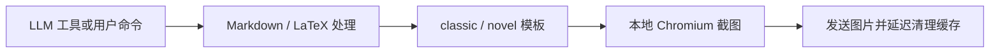

<div align="center">
  
  <h1>LaTeX Render</h1>
  <p><strong>让 LLM 把公式、表格与长讲解直接排成一张好读的图。</strong></p>
  <p>面向 AstrBot 的本地 Markdown / LaTeX 图片渲染插件。内容在本机 Chromium 中完成排版，LLM 可以主动调用工具出图，用户也可以通过命令切换和预览模板。</p>
  <p>
    <a href="https://github.com/AstrBotDevs/AstrBot"></a>
    <a href="https://github.com/6TBWhite/astrbot_plugin_latex_render/releases"></a>
    <a href="https://www.python.org/"></a>
    <a href="LICENSE"></a>
  </p>
  <p>
    <a href="#产品定位">产品定位</a> ·
    <a href="#核心能力">核心能力</a> ·
    <a href="#安装与启用">安装使用</a> ·
    <a href="#模板与命令">模板与命令</a> ·
    <a href="#问题排查">问题排查</a> ·
    <a href="CHANGELOG.md">版本变化</a>
  </p>
</div>

## 产品定位

普通文本回复很适合短回答，却不擅长承载长公式、复杂表格和需要稳定版式的讲解。LaTeX Render 给 AstrBot 增加一个 `render_to_image` 工具：LLM 先写完整内容，插件再把 Markdown、LaTeX 和模板样式交给本地 Chromium，最后只把生成的图片发送到当前会话。

插件不接管正常回复，也不依赖在线排版服务。MathJax 随插件离线提供，内置模板只使用宿主机字体；是否出图、写什么内容、选哪个模板，仍由当前 Agent 和用户指令决定。

当前稳定版本为 `1.0.3`，要求 AstrBot `>=4.26.3`。

## 核心能力

| 能力 | 带来的体验 | 默认边界 |
| --- | --- | --- |
| LLM 主动出图 | Agent 可调用 `render_to_image`，把整段回复一次排成图片 | 不拦截普通消息，不强制所有回答转图 |
| Markdown 排版 | 支持标题、列表、引用、代码块、删除线和表格 | Markdown 可在 WebUI 中关闭 |
| LaTeX 公式 | 支持 `$...$`、`$$...$$`、`\(...\)`、`\[...\]` 和常见环境 | MathJax 使用随插件提供的本地副本 |
| 双内置模板 | `classic` 适合讲题与知识整理，`novel` 适合叙事和对白 | 模板必须位于 `templates/`，且至少保留一个 |
| 用户模板偏好 | 用户可切换自己的默认模板，也可临时预览其他模板 | 偏好保存在当前插件进程内，重载后恢复全局默认 |
| 本地渲染 | 内容由 Playwright / Chromium 在 AstrBot 主机上生成 | 首次使用需要浏览器二进制和 Linux 系统库 |
| 临时原文上下文 | 可选地让 LLM 在后续轮次核对已经发成图片的原文 | 实验性、默认关闭，按完整会话隔离 |

## 渲染流程



渲染缓存和 Playwright 浏览器默认写入：

```text
data/plugin_data/astrbot_plugin_latex_render/
├── latex_cache/
└── playwright_browsers/
```

插件不会把运行数据写回源码目录，因此更新或重装插件时不会把缓存和浏览器文件混进插件包。

## 安装与启用

### 安装

推荐在 AstrBot WebUI 的插件市场中搜索“LaTeX / Markdown 图片渲染”并安装。若暂未检索到，可从 [GitHub Releases](https://github.com/6TBWhite/astrbot_plugin_latex_render/releases) 下载 ZIP，再进入“AstrBot 插件 → 安装插件 → 从文件安装”上传。

也可以在支持仓库地址安装的界面中使用：

```text
https://github.com/6TBWhite/astrbot_plugin_latex_render
```

安装或更新后，请重载插件或重启 AstrBot。

### 依赖分工

别把 `pip install` 成功当成万事大吉，Playwright 偏偏还带着浏览器和系统库两位不肯住进 `requirements.txt` 的祖宗。

| 依赖 | 默认处理方式 | 是否可能需要手动安装 |
| --- | --- | --- |
| `playwright`、`mistune`、`Pillow` | AstrBot 根据 `requirements.txt` 自动安装 | 仅在 AstrBot 自动安装失败时 |
| Chromium headless shell | 插件首次启动时自动下载到插件数据目录 | 网络受限、无写入权限或自动下载失败时 |
| Chromium 系统库 | Python 包和插件都不会替你取得 root 权限 | **Linux / Docker 精简镜像通常必须手动安装** |
| CJK 中文字体 | 使用宿主机已有字体 | **裸 Linux / 精简容器通常必须手动安装** |

### 必看：不会自动安装的项目

#### 1. Linux 的 Chromium 系统库

插件不会、也不应该在启动时调用 `sudo`。Debian / Ubuntu 及受支持的 Linux 环境中，请在 AstrBot 使用的同一 Python 环境里执行：

```bash
sudo python -m playwright install-deps chromium
```

Docker 部署请进入 AstrBot 容器，并以具备包管理权限的用户执行。命令来自 [Playwright 官方浏览器安装说明](https://playwright.dev/python/docs/browsers#install-system-dependencies)。

#### 2. Linux 的中文字体

裸 Linux 和精简容器常常没有 CJK 字体，缺少时中文会显示为方块。

```bash
# Ubuntu / Debian
sudo apt-get update
sudo apt-get install -y fonts-noto-cjk fonts-noto-cjk-extra

# CentOS / RHEL
sudo yum install -y google-noto-sans-cjk-ttc google-noto-serif-cjk-ttc

# Fedora 或较新的 RHEL
sudo dnf install -y google-noto-sans-cjk-fonts google-noto-serif-cjk-fonts
```

验证：

```bash
fc-list :lang=zh | head
```

能够列出 `.ttc` 或 `.otf` 文件才算装好。插件不会自动检测或安装系统字体。

#### 3. 自动下载 Chromium 失败时

启动日志会打印插件实际使用的 `Playwright 浏览器路径`。手动安装时必须把 `PLAYWRIGHT_BROWSERS_PATH` 指向同一路径，否则浏览器会装进系统缓存，而插件仍旧一本正经地说没看见。

Linux / macOS：

```bash
export PLAYWRIGHT_BROWSERS_PATH="/你的/AstrBot/data/plugin_data/astrbot_plugin_latex_render/playwright_browsers"
python -m playwright install chromium-headless-shell
```

Windows PowerShell：

```powershell
$env:PLAYWRIGHT_BROWSERS_PATH = "C:\你的\AstrBot\data\plugin_data\astrbot_plugin_latex_render\playwright_browsers"
python -m playwright install chromium-headless-shell
```

如果 AstrBot 没有自动安装 Python 库，再在插件目录执行：

```bash
python -m pip install -r requirements.txt
```

代理环境下可在安装前设置 `HTTPS_PROXY`；具体写法见 [Playwright 官方代理说明](https://playwright.dev/python/docs/browsers#install-behind-a-firewall-or-a-proxy)。

## 首次使用

1. 重载插件，确认日志出现“浏览器实例已启动”和“插件初始化完成”。
2. 发送 `/测试`，使用默认内容检查 Markdown、代码块和公式。
3. 发送 `/查看` 查看模板，再用 `/切换 classic` 或 `/切换 novel` 设置偏好。
4. 在 Agent 对话中明确要求“把完整讲解渲染成图片”，检查 `render_to_image` 工具调用。

首次启动需要下载数百 MB 的 Chromium headless shell，耗时取决于网络。下载完成后会复用插件数据目录中的浏览器文件。

## 配置

以下配置均可在 AstrBot WebUI 修改，并与 `_conf_schema.json` 保持一致。

| 配置项 | 默认值 | 说明 |
| --- | ---: | --- |
| `default_template` | `""` | 全局默认模板；留空时使用第一个可用模板 |
| `render_width` | `600` | 渲染宽度，单位 px |
| `render_scale` | `2` | 设备缩放倍数；越高越清晰，也越耗内存 |
| `enable_markdown` | `true` | 启用 Markdown 解析 |
| `enable_math` | `true` | 启用 LaTeX / MathJax 渲染 |
| `classic_body_padding` | `18` | `classic` 外圈边距 |
| `classic_page_padding_y` | `32` | `classic` 画布上下内边距 |
| `classic_page_padding_x` | `28` | `classic` 画布左右内边距 |
| `classic_font_size` | `22` | `classic` 正文字号 |
| `classic_line_height` | `1.8` | `classic` 正文行高 |
| `classic_h1_size` | `31` | `classic` 一级标题字号 |
| `classic_h2_size` | `26` | `classic` 二级标题字号 |
| `classic_h3_size` | `23` | `classic` 三级标题字号 |
| `inject_template_prompts` | `false` | 向本轮 LLM 请求提供模板格式提示 |
| `enable_hidden_ctx_buffer` | `false` | 临时注入最近三条已渲染原文；实验性功能 |

## 模板与命令

### LLM 工具

`render_to_image` 接收完整 Markdown / LaTeX 内容：

```text
render_to_image(
  content="## 勾股定理\n设两直角边为 $a$、$b$，斜边为 $c$：\n$$a^2+b^2=c^2$$",
  template="classic"
)
```

| 参数 | 必填 | 说明 |
| --- | --- | --- |
| `content` | 是 | 要渲染的完整内容，不要再包 `<render>` 标签 |
| `template` | 否 | `classic`、`novel` 或其他已有模板名；留空使用用户默认 |

### 用户命令

| 命令 | 英文别名 | 功能 |
| --- | --- | --- |
| `/测试 [文本]` | `/test` | 渲染输入文本；不填时使用内置测试内容 |
| `/切换 <名称或 ID>` | `/switch` | 切换当前用户的默认模板 |
| `/查看` | `/templates` | 查看模板列表与当前模板 |
| `/预览模板 <名称或 ID> [文本]` | `/previewtpl`、`/tplpreview` | 临时预览，不修改默认模板 |
| `/探针gif` | `/probegif` | 输出三帧诊断截图；这是排障命令，不是 GIF 产品功能 |

### `classic`

适合讲题、结构化知识、公式、代码和表格。绿色外框与浅色画布针对聊天窗口阅读优化，正文、标题、行高和边距均可在 WebUI 调整。

### `novel`

适合叙事、对白和场景描写，额外支持：

| 标签 | 用途 |
| --- | --- |
| `<q>` | 对话台词 |
| `<inner>` | 内心独白 |
| `<act>` | 动作描写 |
| `<scene>` | 场景描写 |
| `<aside>` | 旁白 |

自定义模板放入 `templates/`，文件扩展名必须为 `.html`，并保留 `{{content}}` 占位符。模板使用 UTF-8 编码；目录为空时插件会拒绝带病启动。

## 字体与外部资源

内置模板只声明思源黑体、思源宋体、苹方、微软雅黑、宋体等系统字体，不携带字体文件，也不依赖 Google Fonts。渲染效果由宿主机实际安装的字体决定。

Playwright 会阻断 Google Fonts 请求以避免渲染被外网拖住。自定义模板若需要固定字体，请把 `.woff2` 等文件随插件部署，并通过本地路径引用；仅写在线字体 URL 会回退到后备系统字体。

MathJax 使用仓库内的 `mathjax-tex-svg.js`，正常渲染无需连接 CDN。

## 问题排查

### 日志提示找不到 Chromium

1. 找到启动日志中的 `Playwright 浏览器路径`。
2. 按“自动下载 Chromium 失败时”设置同一个 `PLAYWRIGHT_BROWSERS_PATH`。
3. 在 AstrBot 的 Python 环境中重新安装 headless shell。
4. Linux 再执行 `python -m playwright install-deps chromium`。

AstrBot 更新后无需删除浏览器目录；插件把它放在 `data/plugin_data` 下，就是为了随数据备份保留。

### 中文显示成方块

运行 `fc-list :lang=zh | head`。没有输出就安装 Noto CJK 字体；有输出仍异常时，检查自定义模板的 `font-family` 是否只写了宿主机不存在的字体。

### 公式没有渲染

- 确认 `enable_math = true`。
- 使用受支持的分隔符：`$...$`、`$$...$$`、`\(...\)` 或 `\[...\]`。
- 查看日志是否成功加载本地 `mathjax-tex-svg.js`。
- 不要把公式放进代码块；代码块中的 `$...$` 会按普通代码保留。

### 图片底部被截断或渲染失败

- 先把 `render_scale` 调回 `2`，避免超大图片耗尽内存。
- 用 `/测试` 排除自定义内容和模板问题。
- 确认 `templates/` 至少有一个包含 `{{content}}` 的 HTML 文件。
- 若只有自定义模板失败，先移除脚本、远程资源和异常 CSS 再逐项恢复。

## 项目结构

```text
astrbot_plugin_latex_render/
├── main.py                 生命周期、命令、LLM 工具与模板选择
├── renderer.py             Playwright 浏览器复用、截图与 GIF 原型
├── text_processing.py      Markdown、LaTeX 保护与换行处理
├── template_manager.py     模板发现、读取与内置提示提取
├── templates/              classic / novel 模板
├── mathjax-tex-svg.js      离线 MathJax
├── _conf_schema.json       AstrBot WebUI 配置定义
├── metadata.yaml           插件市场元数据
└── tests/                  文本、模板与元数据回归测试
```

## 开发验证

在插件目录运行：

```bash
python -m pytest -q
python -m ruff check .
python -m ruff format --check .
```

完整渲染还需要在 AstrBot 中重载插件，并至少执行一次 `/测试`。纯单元测试不会替你下载 Chromium，也不会假装一张图已经真的发出去了。

## 致谢与许可

项目灵感来自 [lumingya/astrbot_plugin_html_render](https://github.com/lumingya/astrbot_plugin_html_render)，并沿用其 MIT 许可允许的设计思路。

[AstrBot](https://github.com/AstrBotDevs/AstrBot) · [更新记录](CHANGELOG.md) · [MIT License](LICENSE)
